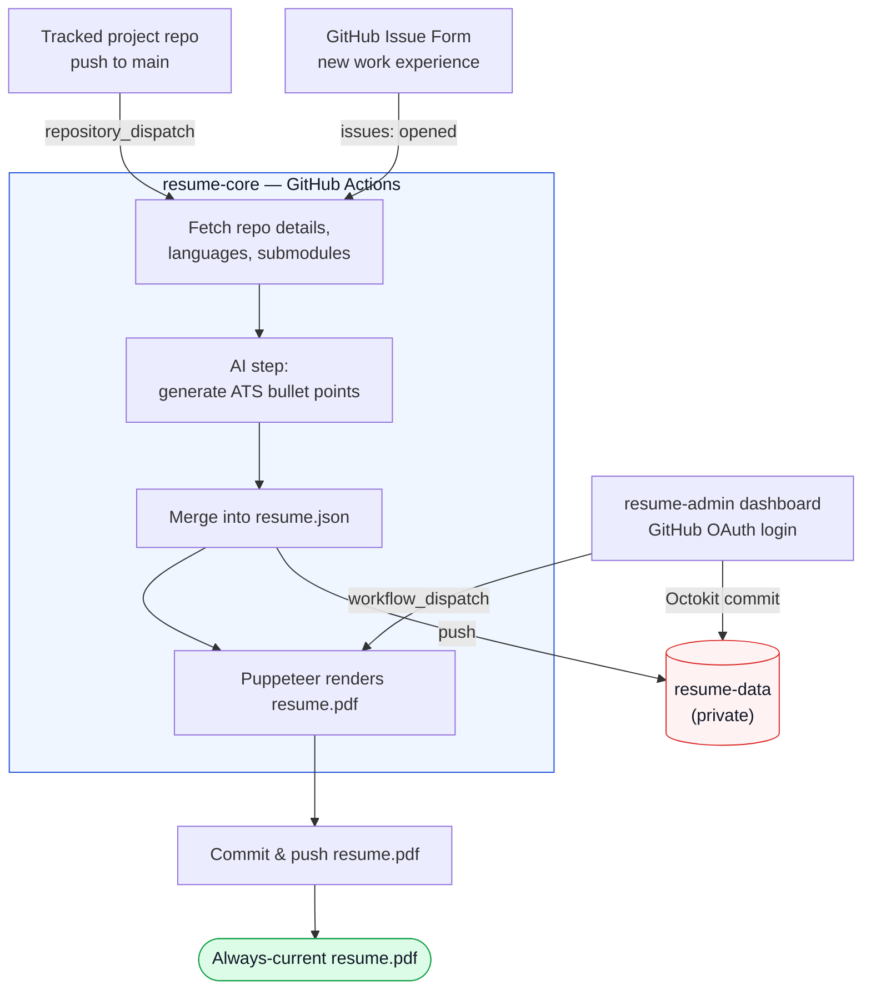

<div align="center">


### Event-driven Software Engineering resume pipeline — zero manual backend code, zero self-hosted infrastructure.


</div>

---

## What this is

Push code to a tracked project repo, or submit a work-experience Issue Form
— a resume PDF updates itself, automatically, within minutes. No backend
server, no database, no self-hosted cron job. Every moving part is either a
GitHub Actions workflow or a stateless Next.js app.

This repository is the **parent project**: architecture/design docs, plus
two git submodules that do the actual work.

| Submodule | Role |
|---|---|
| [`resume-core`](https://github.com/ChamathDilshanC/resume-core) | Handlebars/CSS template, Puppeteer PDF renderer, and the GitHub Actions workflows that tie it all together |
| [`resume-admin`](https://github.com/ChamathDilshanC/resume-admin) | A private, single-login Next.js dashboard for editing every section of `resume.json` without touching git by hand |

The actual `resume.json` — contact details, reference phone numbers — lives
in a third repo, [`resume-data`](https://github.com/ChamathDilshanC/resume-data),
kept **private** and deliberately *not* wired in as a submodule here (this
repo is public; a private submodule would break `git clone --recurse-submodules`
for anyone without access to it). `resume-core`'s workflows and the
`resume-admin` dashboard both reach it directly over the GitHub API.

## How it flows



## Screenshots

The `resume-admin` dashboard — full-width card editor, GitHub-import with AI-drafted bullets, click-through detail views:

<table>
<tr>
<td width="50%"><br/><sub><b>Basics</b></sub></td>
<td width="50%"><br/><sub><b>Projects</b></sub></td>
</tr>
<tr>
<td width="50%"><br/><sub><b>Add project → Import from GitHub</b></sub></td>
<td width="50%"><br/><sub><b>Skills</b></sub></td>
</tr>
</table>

More in [`resume-admin`'s README](https://github.com/ChamathDilshanC/resume-admin#screenshots).

## Documentation

- [`architecture.md`](architecture.md) — system architecture and data flow
- [`implementation.md`](implementation.md) — phase-by-phase build guide
- [`technologies-used.md`](technologies-used.md) — technology stack rationale
- [`References/`](References/) — design/CSS guidelines, git workflow rules,
  AI prompt specs, and the sample resume data used to bootstrap `resume-core`

## Getting the code

```bash
git clone --recurse-submodules https://github.com/ChamathDilshanC/DevResume-Automation-Pipeline.git
```

Already cloned without `--recurse-submodules`?

```bash
git submodule update --init --recursive
```

Pull in the latest auto-committed resume data/PDF:

```bash
git submodule update --remote resume-core
git add resume-core
git commit -m "chore: bump resume-core submodule reference"
```

## Project structure

```
DevResume Automation Pipeline/
├── architecture.md
├── implementation.md
├── technologies-used.md
├── References/
│   ├── design-guidelines.md
│   ├── git-rules.md
│   ├── prompts.md
│   └── sample-resume.json
├── resume-core/     ← git submodule (pipeline: template, PDF renderer, workflows)
└── resume-admin/    ← git submodule (dashboard: Next.js editor)
```

`resume.json` itself lives in a private third repo,
[`resume-data`](https://github.com/ChamathDilshanC/resume-data) — not cloned
here, not a submodule, reached only over the GitHub API by `resume-core`'s
workflows and the `resume-admin` dashboard.
